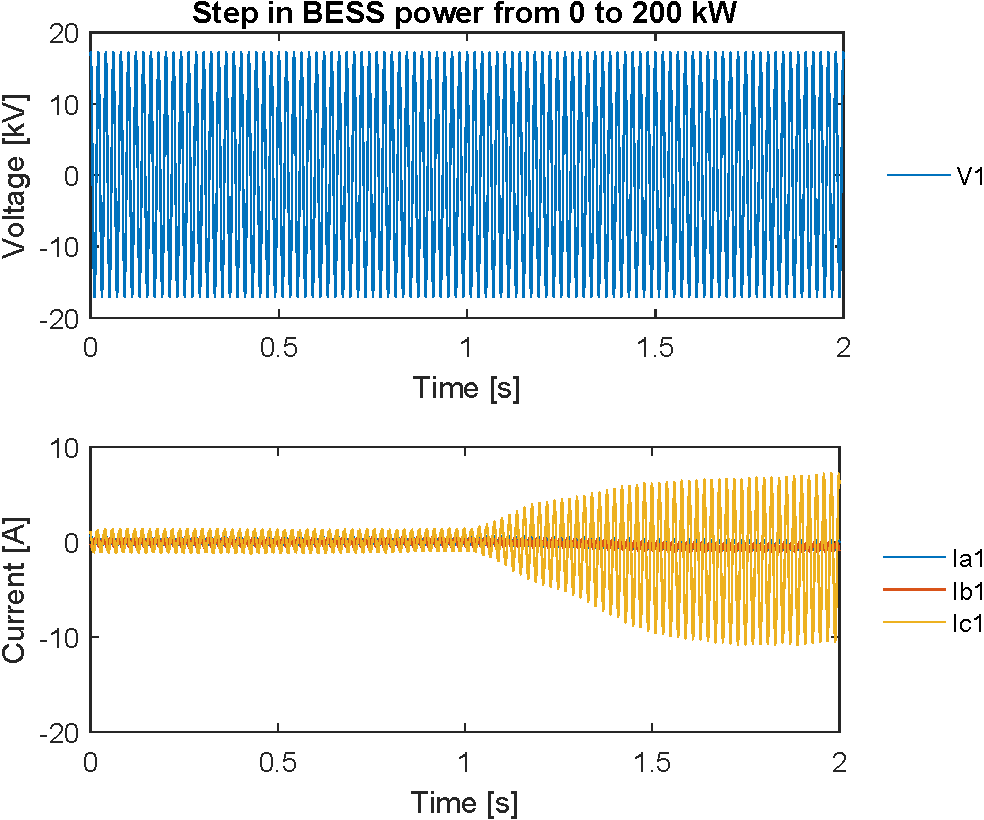
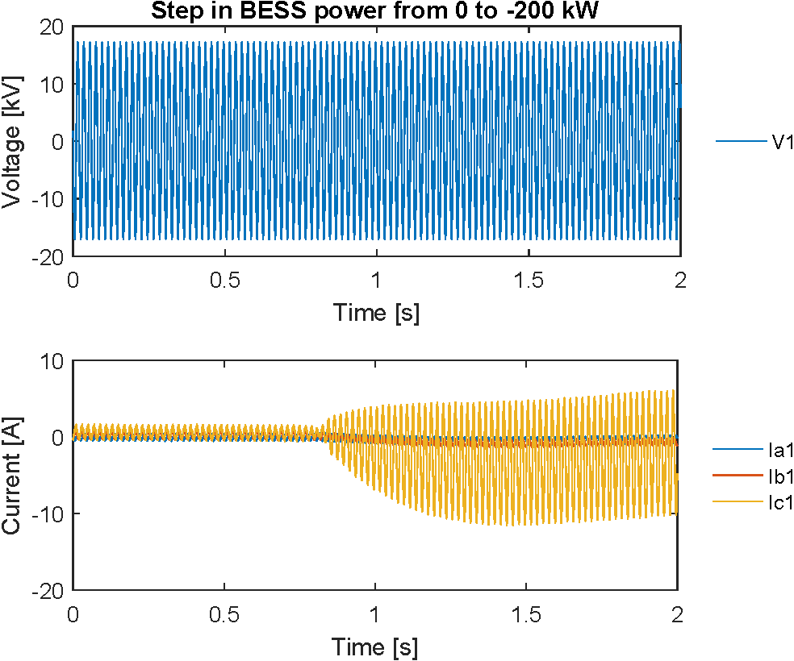

# Point-on-wave Data of EPFL-campus Distribution Network
Point-on-wave data collected on the 20 kV network of EPFL-campus.

## The experimental setup
### The electric network
The data refer to the medium voltage network illustrated in the following figure, representing a 20 kV substation of EPFL campus coupled with a battery energy storage system (BESS).

The busbar is composed of 2 line departures connecting neighbor substations, 2 MV/LV 630 kVA transformers supplying electricity to office buildings, and one cable connecting the BESS. 

### The sensing infrastructure
The waveform recorder functionality has been integrated in the PMU developed in EPFL-DESL laboratory.
The hardware platform is based on the National Instruments [compactRIO 9068](http://www.ni.com/pdf/manuals/376007a_02.pdf), an embedded industrial controller with a dual-core ARM Cortex-A9 processor and equipped with a customized Linux-RT OS, a user-programmable Field Programmable Gate Array (FPGA) Artix-7 equipped with a 40 MHz free-running clock and reconfigurable IO modules. 
The device has been equipped with:
* A stationary GPS unit [NI-9467](http://www.ni.com/datasheet/pdf/en/ds-537) for the synchronization to UTC-time, accurate to within +- 100 ns. The GPS antenna is mounted on the rooftop of DESL laboratory with a full-sky visibility and is coupled to the module via a 30-meters RG-213 shielded cable (GPS coordinates 46.51834 latitude, 6.56522 longitude);
* Two analog input modules [NI-9215](http://www.ni.com/pdf/manuals/373779a_02.pdf) characterized by an input range of +- 10 V and a sampling frequency of 50 kHz.

The medium voltage signals are acquired by dedicated instrument transformer manufactured by Altea Solutions. Specifically, [CS-50-I](http://www.alteasolutions.com/pdf/Datasheet%20CS-50-I%20Altea) current class 0.2 and [VS-24-C](http://www.alteasolutions.com/pdf/Technical%20Specifications%20VS-24-C.pdf) voltage class 0.5 sensor.

### The battery storage system
The variations in current magnitude shown in the data have been generated by a 560 kWh/720 kVA BESS. Such BESS is composed by Lithium titanate oxide (LTO) cells arranged in series and parallel to form 9 battery racks connected to a DC bus whose voltage oscillates between 590 and 810 V. The DC bus is interfaced with the medium-voltage grid through a four quadrant DC-AC converter and a 0.3/21 kV, 630 kVA transformer. 

The power injection of the BESS is controlled by requesting active and reactive power setpoints to the converter. Such requests are sent to the converter controller from a desktop computer connected on the same subnet through the ModBUS TCP protocol.

## Data
The waveforms enclosed to this report have been obtained by, in rapid sequence, (i) starting the recording and (ii) imposing a step in the active power injection of the BESS.
The data cover 5 events:
* BESS idle;
* step in BESS power from 0 to 500 kW;
* step in BESS power from 0 to -500 kW;
* step in BESS power from 0 to 200 kW;
* step in BESS power from 0 to -200 kW;
* step in BESS power from -500 to 500 kW.

Note that we apply an *active sign convention*. That is, a positive BESS active power corresponds to the BESS discharging/injecting power into the grid. For each event, the following quantities are reported:
* three-phase voltages at the busbar (V1, V2, V3);
* 2 x three-phase line currents absorbed by two transformers (ia1, ia2, ia3 and ib1, ib2, ib3).
* three-phase line currents absorbed by the BESS transformer (ic1, ic2, ic3);

Such quantities are stored with 20 μs sampling time and for a duration of 2 seconds.
The measures should be scaled with an amplification gain of 3500 for the voltage, 3.1 for the current absorbed by the BESS and 1 for those by the two transformers. 

### Data format
5 Matlab structure variables are provided, each containing data from one of the considered events:
* BESS_idle.mat;
* BESS_0_to_p500.mat;
* BESS_0_to_m500.mat;
* BESS_0_to_p200.mat;
* BESS_0_to_m200.mat;
* BESS_m500_to_p500.mat. 
Each structure has 12 fields, corresponding to the 12 quantities listed above. Each field is a column array containing the respective data. The names of the structures and fields are self-explanatory.

## References
* F. Sossan, E. Namor, R. Cherkaoui and M. Paolone, "Achieving the Dispatchability of Distribution Feeders Through Prosumers Data Driven Forecasting and Model Predictive Control of Electrochemical Storage," in IEEE Transactions on Sustainable Energy, vol. 7, no. 4, pp. 1762-1777, Oct. 2016. Available [here](https://arxiv.org/abs/1602.02265)
* P. Romano and M. Paolone, "Enhanced Interpolated-DFT for Synchrophasor Estimation in FPGAs: Theory, Implementation, and Validation of a PMU Prototype," in IEEE Transactions on Instrumentation and Measurement, vol. 63, no. 12, pp. 2824-2836, Dec. 2014. Available [here](https://www.researchgate.net/publication/273394523_Enhanced_Interpolated-DFT_for_Synchrophasor_Estimation_in_FPGAs_Theory_Implementation_and_Validation_of_a_PMU_Prototype) 
* M. Pignati et al., "Real-time state estimation of the EPFL-campus medium-voltage grid by using PMUs," 2015 IEEE Power \& Energy Society Innovative Smart Grid Technologies Conference (ISGT), Washington, DC, 2015, pp. 1-5. Available [here](https://www.researchgate.net/publication/279545439_Real-time_state_estimation_of_the_EPFL-campus_medium-voltage_grid_by_using_PMUs)

## Figures

